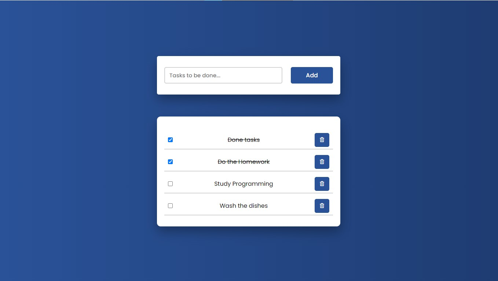

# To-do-List JS

To-do-List simple aplication with data persistence build with:

<h3 align="center">
        
    </h3>

- HTML
- CSS
- JAVASCRIPT

I won't lie, I had a lot of difficulty developing this project, but the tutorials always saves me.
